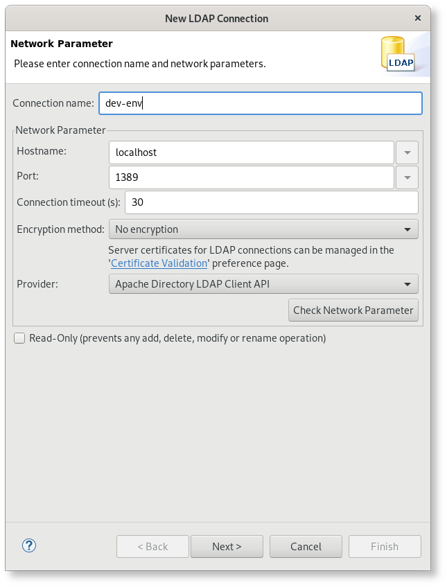
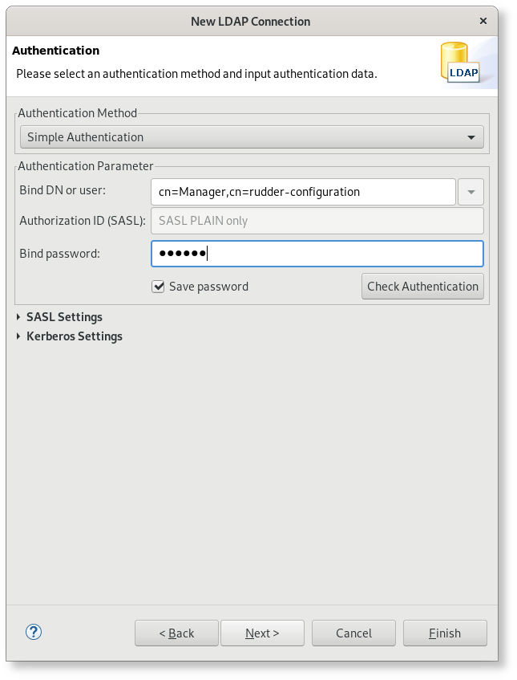
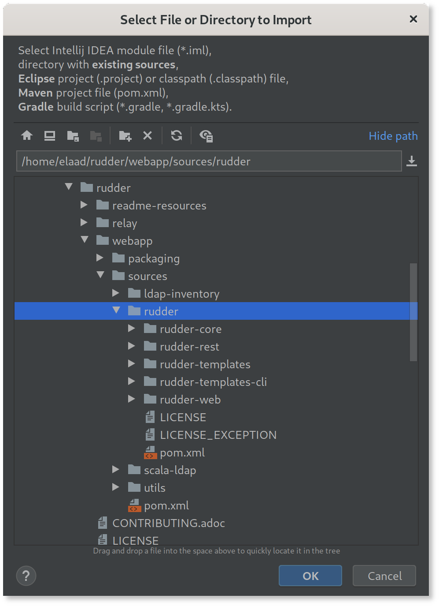

# How to setup your development's environment for Rudder's web application

## Synopsis
This is a **straightforward guide** aims to setup all tools and settings on a Linux OS, to be able to modify Rudder source code and to test it locally. Please follow these steps in the order of the guide. If you want to learn more about the tools feel free to read the document link to it !

## Requirements
- Vagrant
- Virtual Box and Oracle VM VirutalBox Extension pack
- IntelliJ
- OpenJDK 8 at least
- git
- netstat

## Table of Contents  
- [Synopsis](#synopsis)
- [Requirements](#requirements)
- [Part 1 : Setup the local environment and the dev box](#part-1---setup-the-local-environment-and-the-dev-box)
  * [Install Rudder Test framework (RTF)](#install-rudder-test-framework--rtf-)
  * [Create a platform description file](#create-a-platform-description-file)
  * [Setup the local environment](#setup-the-local-environnement)
    + [Create potentially missing files and add permission](#create-potentially-missing-files-and-add-permission)
    + [Synchronize techniques](#synchronize-techniques)
  * [Setup you vagrant box environment](#setup-you-vagrant-box-environment)
  * [Test LDAP connection](#test-ldap-connection)
- [Part 2 : Setup workspace development with IntelliJ and Maven](#part-2---setup-workspace-development-with-intellij-and-maven)
  * [Install plugin from marketplace](#install-plugin-from-marketplace)
  * [Import Rudder project](#import-rudder-project)
  * [Setup Run configuration](#setup-run-configuration)
  * [Setup Module and sources](#setup-module-and-sources)
  * [Install maven dependencies](#install-maven-dependencies)
    + [XML Settings File](#xml-settings-file)
    + [Import dependencies](#import-dependencies)
  * [Setup File Watchers (Highly recommended)](#setup-file-watchers--highly-recommended-)
- [Now what ?](#now-what--)
    + [Documentations](#documentations)
    + [Contribution](#contribution)
    + [Bug reports](#bug-reports)
    + [Community](#community)

## Part 1 : Setup the local environment and the dev box
Make sure you have installed [VirtualBox](https://www.virtualbox.org/wiki/Downloads) and Oracle VM VirutalBox Extension pack.

### Install Rudder Test framework (RTF)
Please follow these [steps](https://github.com/Normation/rudder-tests#rudder-tests) to install Rudder Test framework

### Create a platform description file
In `rudder-test/platform` directory there is some examples of platform's descriptions.
Please read https://github.com/Normation/rudder-tests#adding-a-platform-or-an-os for further information.

Create a `<dev_env_name>.json` file in `rudder-test/platform` and put your platform's configuration in it. You can reuse debian9.json configuration.
> The name of the file will be the name of the environment.

In our case we want to deploy locally for a development environment you will need to make sure that the `server` field contains at least `"rudder-setup": "dev-server"`   
E.g :   
```"server" : { "rudder-setup": "dev-server"}```
> Note : you will not be able to access Rudder at this stage, you will need to run Rudder through IntelliJ to be able to access it locally. If you only want to test Rudder without making any changes, replace `"rudder-setup": "dev-server"` by `"rudder-setup": "server"`

When your file is ready, you will have to create the box by running :
```
./rtf platform setup <env's name>
```

Now you can test that the environment is working by typing :   

```
sudo netstat -laputn | grep 15432
```
The output should be :
```
tcp        0      0 0.0.0.0:15432           0.0.0.0:*               LISTEN
```

You can find back the port number in the Vagrantfile.

To connect on the box use in `rudder-test` directory:
```
vagrant ssh <env's name>_server
```

### Setup the local environnement
#### Create potentially missing files and add permission

1. Create some file for the webapp :
```
mkdir -p /var/rudder/inventories/incoming /var/rudder/share /var/rudder/inventories/accepted-nodes-updates /var/rudder/inventories/received /var/rudder/inventories/failed /var/log/rudder/core /var/log/rudder/compliance/ /var/rudder/run/       
touch /var/log/rudder/core/rudder-webapp.log /var/log/rudder/compliance/non-compliant-reports.log /var/rudder/run/api-token
```

2. Add permissions
```
sudo chown <username> -R /var/rudder/
sudo chown <username> -R /var/log/rudder
```
make sure that `/var/rudder` and `/var/log/rudder` is own by you with :
```
 ls -l /var/rudder /var/log/rudder
```

#### Synchronize techniques
1. Clone rudder-techniques repo by :
```
rudder-dev rudder-techniques
```
or
```
git clone git@github.com:Normation/rudder-techniques.git
```
2. Move technique's directory to `/var/rudder/configuration-repository/`
```
sudo cp -r rudder-techniques/techniques/ /var/rudder/configuration-repository/
```

3. git add and commit techniques directory in `/var/rudder/configuration-repository/`
```
git add techniques/
git commit -m "what ever you want"
```

### Setup you vagrant box environment
1. Connect to your vagrant box env, in rudder-test directory :
```
vagrant ssh <env's name>_server
```
2. Make sure that the file `/etc/systemd/system/rudder-slapd.service.d/override.conf`
contains :
```
[Service]
ExecStart=
ExecStart=/opt/rudder/libexec/slapd -n rudder-slapd -u rudder-slapd -f /opt/rudder/etc/openldap/slapd.conf -h "ldap://0.0.0.0:389/"
```
Otherwise override it.
3. Reload services :
```
systemctl daemon-reload
service rudder-slapd restart
```

4. In vagrant box, find in /opt/rudder/etc/openldap/slapd.conf the two lines starting with `rootdn` and `rootpw` and keep them for the next section
rootdn should look like that :
`rootdn>->-"cn=Manager,cn=rudder-configuration"`

### Test LDAP connection
1. Download Apache Directory Studio and run it
2. in _LDAP -> New Connection_
- define a connection's name
- Hostname : localhost
- Port : 1389

Click on _Check Network Parameter_, a windows appear tell you that the connection was established successfully
if so click on next



3. Complete with following parameters :
- Bind DN or user : `cn=Manager,cn=rudder-configuration` (the `rootdn` parameter see previous step)
- Bind password : the `rootpw` value
click on Check the Authentication, it should be a success, click on apply and close if so


Now your are sure that LDAP connection is working

## Part 2 : Setup workspace development with IntelliJ and Maven
### Install plugin from marketplace
1. In IntelliJ install plugins : Scala, Elm, Jetty Runner and File watcher (recommended)

### Import Rudder project
1. Import rudder repository :
```
git clone git@github.com:ElaadF/rudder.git
```

2. In IntelliJ : _Import Project or File -> New -> Module from existing sources_
and choose `/rudder/webapp/sources/rudder` or you can choose only the modules that you need (compliance will be faster)
And then chose "Import Module from external model" and take Maven


### Setup Run configuration
1. In _Run -> Edit Configuration_ add a new configuration and choose Jetty Runner
- Module : <all modules>
- Path : `/rudder`
- WebApp Folder :
```
<rudder's path directory>/webapp/sources/rudder/rudder-web/src/main/webapp
```

- Classes Folder :
```
<rudder's path directory>/webapp/sources/rudder/rudder-core/target/classes, <rudder's path directory>/webapp/sources/rudder/rudder-web/target/classes
```

- Runs on Port : 8080
- VM Args :
```
\-DrjrDisableannotation=true -Drun.mode=production -XX:MaxPermSize=360m -Xms256m -Xmx2048m -XX:-UseLoopPredicate -XX:+UseG1GC -XX:+UnlockExperimentalVMOptions -XX:+UseStringDeduplication -Drudder.configFile=/home/elaad/rudder-tests/dev/configuration.properties
```

If you are using JRebel add these following arguments :
```
-noverify -Drebel.lift_plugin=true -Drebel.spring_plugin=false -noverify -agentpath:<jrebel's path directory>/lib/libjrebel64.so
```

### Setup Module and sources
In IntelliJ : _File -> Project Structure -> Project settings_

- Make sure that the Project java SDK is at least at version 8, same for Project language level

- In `Modules` make sure that every your modules have a Language level at 8 at least
- For every modules mark src/main/Scala as Sources


- Setup display format file manager


### Install maven dependencies

#### XML Settings File
Use the template [here](settings.xml) and create `~/.m2/settings.xml` and replace ` <localRepository>[PATH TO .m2 DIRECTORY]</localRepository>` line by the path to this directory.   

> If **you are in the Rudder's Organization** put your `Username` and `Password` in the right fields.
#### Import dependencies
To import dependencies that Rudder use you will have to run :
```
mvn clean install
```
Inside :
- `rudder/webapp/sources/`
- `rudder/webapp/sources/rudder`
- At the root of every modules that you have import into IntelliJ (rudder-code, rudder-web, rudder-rest, rudder-templates, rudder-templates-cli)
> Note : It can take several minutes to download all necessary dependencies.

### Setup File Watchers (Highly recommended)
The purpose of File Watcher is to automatically make action on defined type files
when they are modify. In Rudder we use it to move generate frontend file (css, html, elm)
to the right directory when they are modify.
In Files -> Settings -> tools -> File Watchers
Add 3 new Watcher : for CSS, HTML and Elm file with these configurations (change `file type` according to the watcher) :

The `Program` field value is the same for these 3 watchers


Otherwise at every modification you will need to run the `src/main/elm/build-dev.sh` script in the module.

## Running Rudder

**Congratulation** the process if over !   
You can now compile and running Rudder in IntelliJ !   
You can access to the application on : You can now access Rudder by running the application in IntelliJ on :
##### http://localhost:8080/rudder
> Note : The path may change, it depends on Jetty Run configuration, for the port number and the path.

> Warning : make sure your development's environment is running before running Rudder. `./rtf platform setup <env's name>` in rudder-test directory. Otherwise you will get errors in IntelliJ run console.

Let's coding ! :rocket:
## Now what ?

#### Documentations
If you want to learn how to use Rudder and his web interface you can consult the documentation here : https://docs.rudder.io/reference/5.0/usage/web_interface.html :shipit:

#### Contribution
If you want to submit your code, please feel to contribute by following the [process of submitting your code](https://github.com/Normation/rudder/blob/master/CONTRIBUTING.adoc), we would be happy to review your code and and see coming new contributors ! :heart:
#### Bug reports
If you detect any bugs in the application please feel free to report it by register here if you don't have already an account : https://issues.rudder.io/ :bug:

#### Community
If you want to discuss about Rudder and get some helps, you can join our Gitter : https://gitter.im/normation/rudder :speech_balloon:
